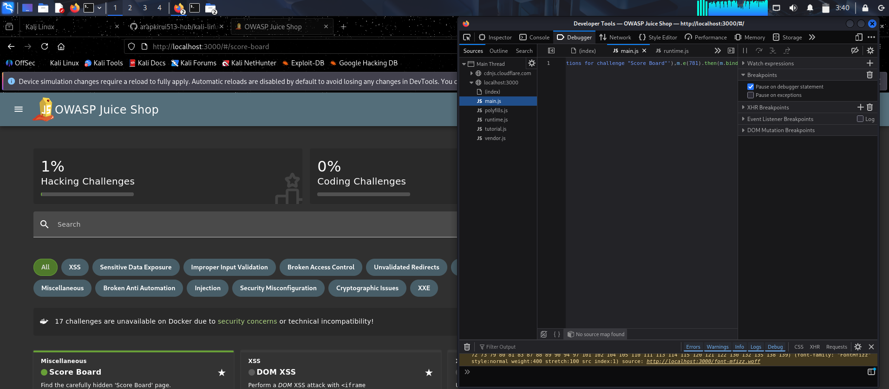
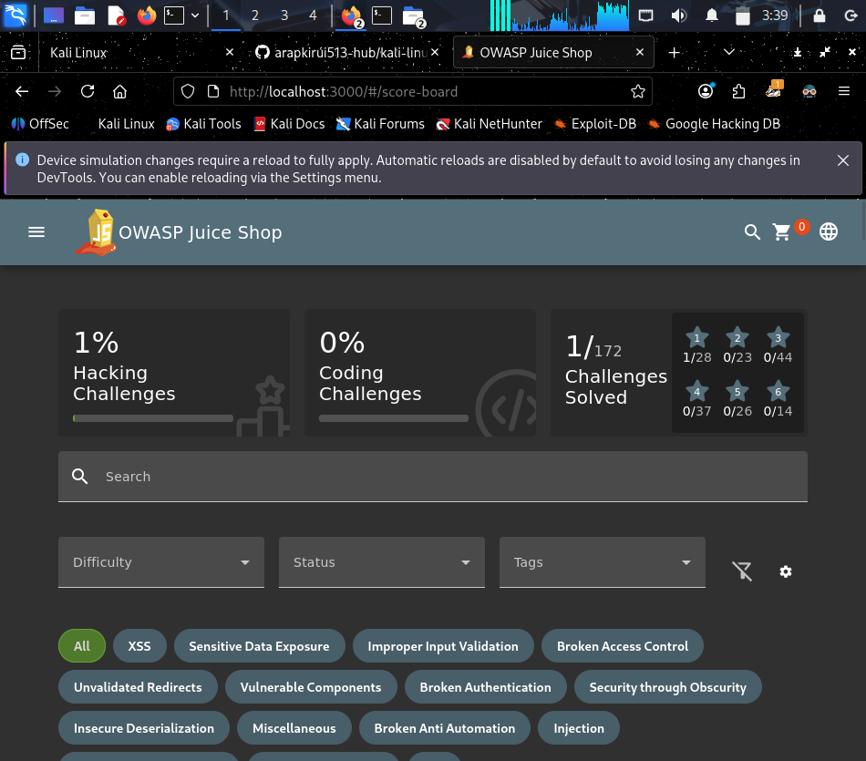

# Challenge 1: Score Board

**Date:** November 18, 2025  
**Difficulty:** ⭐ (1-star)  
**Status:** In Progress

## Objective
Find the hidden Score Board page

## Initial Reconnaissance
- Opened Juice Shop at localhost:3000
- Noticed no obvious "Challenges" or "Score Board" link
- Need to find hidden routes

## Attempts
1. [1. Opened browser Developer Tools (F12)]
2. [Clicked the Debugger tab (Firefox) or Sources (Chrome)]
3. [Searched JavaScript files for keywords: "score", "board", "challenge"]
4. [Tried various URL guesses]

## Solution[- Discovered the route `/#/score-board` in the JavaScript files.
- Discovered the route `/#/score-board` in the JavaScript files.
- Navigated directly to:  
  `http://localhost:3000/#/score-board`
- Successfully accessed the Score Board page showing all 100 challenges.

## What I Learned
- **Reconnaissance:** Sometimes, core functionality isn’t linked but can be found via JavaScript routes.
- **Tools:** Used browser DevTools to read app source and find hidden URIs.
- **Process:** Experimenting and searching code is key for web CTF challenges.
- **Real-World Insight:** Hidden functionality is common in web apps—attackers will look for it, so testers must too.

