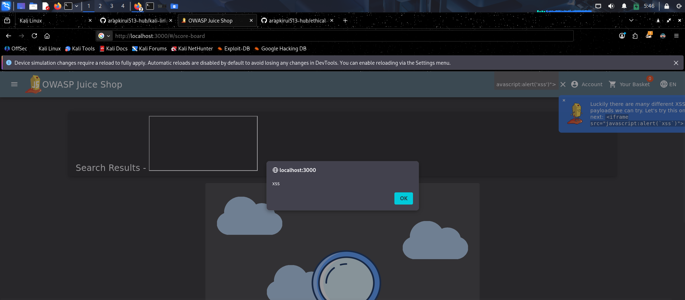
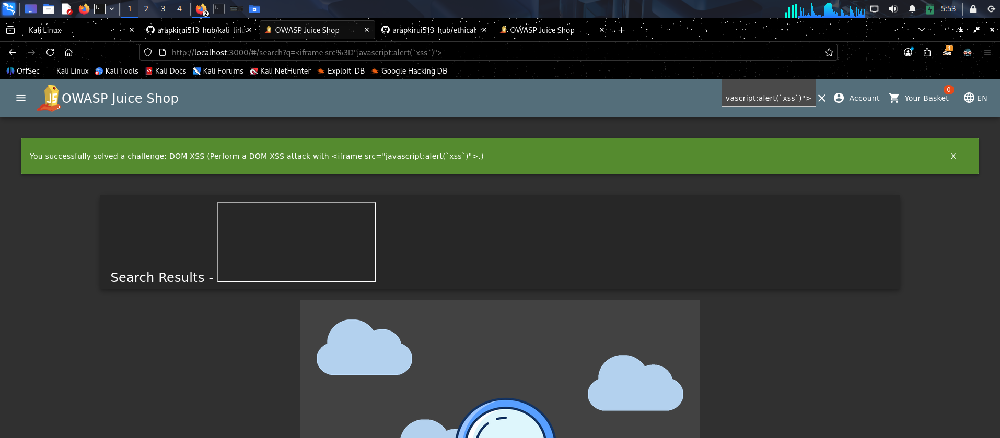

# Challenge 2: DOM XSS

**Date:** November 18, 2025  
**Difficulty:** ⭐ (1-star)  
**Category:** XSS (Cross-Site Scripting)  
**Status:** ✅ Solved

## Objective
Perform a DOM-based Cross-Site Scripting attack

## Solution Process

### Discovery
I tested the search functionality at the top of Juice Shop for XSS vulnerabilities.

### Payload
  html
<iframe src="javascript:alert('XSS')">

### Execution
1. Entered the payload into the search bar
2. Pressed Enter
3. Alert box appeared with "XSS" message
4. Score Board updated showing DOM XSS challenge completed

## How It Works
- The search functionality processes user input with client-side JavaScript
- No proper input sanitization was implemented
- The `<iframe>` tag with `javascript:` protocol executes JavaScript code
- This demonstrates a DOM-based XSS vulnerability

## Screenshots
- 
- 

## What I Learned

### Technical
- DOM XSS occurs entirely in the browser (client-side)
- Different XSS payloads work in different contexts
- The `<iframe src="javascript:...">` payload bypasses some filters
- Always test input fields for injection vulnerabilities

### Real-World Application
- Search bars are common XSS targets
- E-commerce sites often have this vulnerability
- Can be used to steal session cookies, redirect users, or deface pages

### Prevention Methods
- Input validation and sanitization
- Output encoding
- Content Security Policy (CSP) headers
- Use frameworks with built-in XSS protection

## Related Vulnerabilities
- Reflected XSS
- Stored XSS
- Cross-Site Request Forgery (CSRF)

---

**Tags:** `xss`, `dom-xss`, `client-side`, `javascript-injection`, `owasp-top-10`
